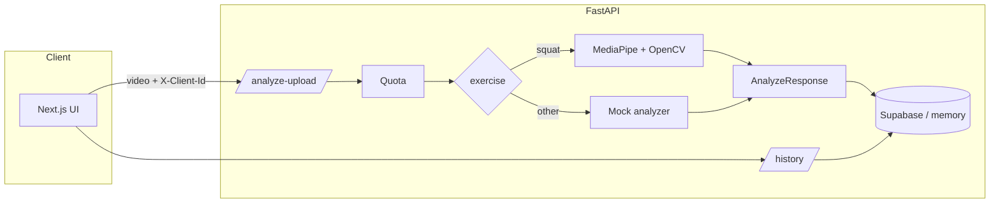

# Workout Form Coach

> Full-stack AI fitness app that analyzes squat videos using MediaPipe/OpenCV and returns form feedback, movement insights, and client-scoped analysis history.

Full-stack MVP for upload-based workout form analysis with structured coaching feedback.

**Resume bullet:** Built a full-stack computer vision fitness app using FastAPI, Next.js, TypeScript, OpenCV, and MediaPipe to analyze squat videos, estimate form quality, detect movement issues, and return coach-style feedback with analysis history and quota tracking.

**Demo assets:** `docs/assets/landing.png` · Demo script: [`docs/DEMO_SCRIPT.md`](docs/DEMO_SCRIPT.md) · Deep dive: [`docs/ARCHITECTURE.md`](docs/ARCHITECTURE.md) · Deploy: [`docs/DEPLOY.md`](docs/DEPLOY.md)

## Live demo

| | URL |
|---|-----|
| **App** | _Deploy to Vercel — set root `frontend`, env `NEXT_PUBLIC_API_URL`_ |
| **API** | _Deploy to Render — see [`docs/DEPLOY.md`](docs/DEPLOY.md)_ |
| **API docs** | `https://YOUR-API.onrender.com/docs` |

After deploy, replace the placeholders above with your live URLs.

## Architecture at a glance



| Stage | What happens |
|-------|----------------|
| **Upload** | Browser sends multipart video + `exercise_type`; persistent `X-Client-Id` from `localStorage` |
| **Quota** | Backend counts analyses in rolling 24h window per client (429 if ≥5) |
| **Inference** | Squat → pose landmarks → rep detection → heuristic aspect scores; other lifts → mock until pipeline added |
| **Persist** | Scores, feedback JSON, recommendations saved for history |
| **UI** | Results cards + clickable history modal |

Full diagrams, sequence flows, and scoring formulas: **[`docs/ARCHITECTURE.md`](docs/ARCHITECTURE.md)**

## Stack

- **Frontend:** Next.js (App Router), TypeScript, Tailwind CSS
- **Backend:** FastAPI, Pydantic v2, MediaPipe + OpenCV (squat analysis)
- **Database:** Supabase (Postgres) — optional for local dev (in-memory fallback)

## Project structure

```
backend/app/          # FastAPI application
  routes/             # HTTP handlers
  services/           # analyzers, Supabase store, squat pose pipeline
  core/               # config, errors
frontend/             # Next.js UI (Performance Lab aesthetic)
supabase/schema.sql   # Postgres schema
```

## Quick start

### 1. Backend

```bash
cd backend
python3.11 -m venv .venv
source .venv/bin/activate
pip install -r requirements.txt
cp .env.example .env
# Optional: set SUPABASE_URL and SUPABASE_SERVICE_ROLE_KEY
uvicorn app.main:app --reload --port 8000
```

API docs: http://localhost:8000/docs

### 2. Supabase (production / persistent history)

1. Create a Supabase project.
2. Run `supabase/schema.sql` in the SQL editor.
3. Add to `backend/.env`:
   - `SUPABASE_URL`
   - `SUPABASE_SERVICE_ROLE_KEY`

Without Supabase, the backend uses an in-memory store (fine for local testing).

### 3. Frontend

```bash
cd frontend
npm install
cp .env.example .env.local
npm run dev
```

Open http://localhost:3000

### 4. Docker (backend only)

```bash
docker compose up --build backend
```

Update root `docker-compose.yml` to point at the new backend if needed.

## API overview

| Method | Path | Notes |
|--------|------|--------|
| POST | `/analyze` | JSON body, mock analyzer |
| POST | `/analyze-upload` | Multipart video + `X-Client-Id` |
| GET | `/history` | Recent analyses, `X-Client-Id` |
| GET | `/history/{id}` | Full analysis detail |

**Quota:** 5 analyses per client per rolling 24h (HTTP 429 when exceeded).

## Squat analysis

`squat` uploads run the MediaPipe Pose Landmarker pipeline (`squat_pose_analyzer.py`):

1. **Decode** video with OpenCV (~10 samples/sec)
2. **Extract** 33 pose landmarks per frame (MediaPipe Tasks API)
3. **Detect reps** from knee-angle valleys (smoothed time series)
4. **Score** three aspects with documented heuristics:
   - **Depth** — min knee flexion per rep (target ~parallel)
   - **Knee tracking** — horizontal knee vs ankle drift
   - **Torso lean** — forward lean vs braced ~32° band
5. **Respond** with `FormFeedback[]`, overall score, rep count, recommendations

This is **applied CV + rule-based coaching**, not a custom trained model — appropriate for product/SWE roles. Logic is explicit in code and [`docs/ARCHITECTURE.md`](docs/ARCHITECTURE.md).

### Extensibility

| Component | Role |
|-----------|------|
| `ExerciseType` enum | Shared exercise IDs across API + UI |
| `routes/analyze.py` | Routes upload to the right analyzer |
| `services/analyzers.py` | Mock placeholder for non-squat lifts |
| `services/*_pose_analyzer.py` | One module per exercise pipeline (squat implemented) |

Adding deadlift = new analyzer module + one branch in the router. API response shape stays the same.

Other exercises use the mock analyzer until their pipeline exists.

## Environment variables

**Backend** (`backend/.env.example`):

- `SUPABASE_URL`, `SUPABASE_SERVICE_ROLE_KEY`
- `CORS_ORIGINS` (default `http://localhost:3000`)
- `DAILY_ANALYSIS_LIMIT`, `QUOTA_WINDOW_HOURS`
- `UPLOAD_DIR`

**Frontend** (`frontend/.env.example`):

- `NEXT_PUBLIC_API_URL` (default `http://localhost:8000`)

## Client ID

The frontend generates a persistent UUID in `localStorage` and sends it as `X-Client-Id` on all API calls for history scoping and quota tracking.

## Roadmap (portfolio priorities)

| Leverage | Item | Status |
|----------|------|--------|
| **A** | Architecture docs + diagrams | ✅ |
| **B** | Joint angles, frame annotations, confidence in API/UI | Next |
| **C** | Stored artifacts (thumbnails, per-rep timestamps) | Next |
| **D** | Production deploy (e.g. Vercel + Cloud Run) | Next |
| — | Real-time webcam | Out of scope for MVP |

## Positioning with LocalLead

| Project | Signal |
|---------|--------|
| **LocalLead** | Product, full-stack, GTM, business systems |
| **Workout Form Coach** | Applied AI, computer vision, media pipeline, health-tech |

Together: you ship end-to-end, understand users, and can go deep on technical domains when needed.
