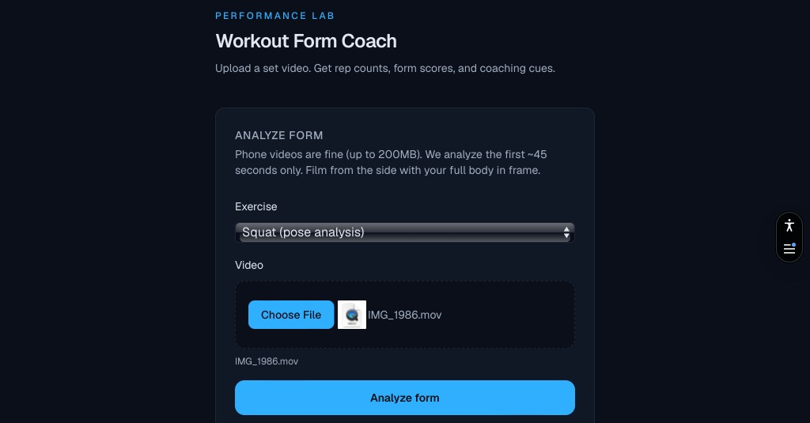
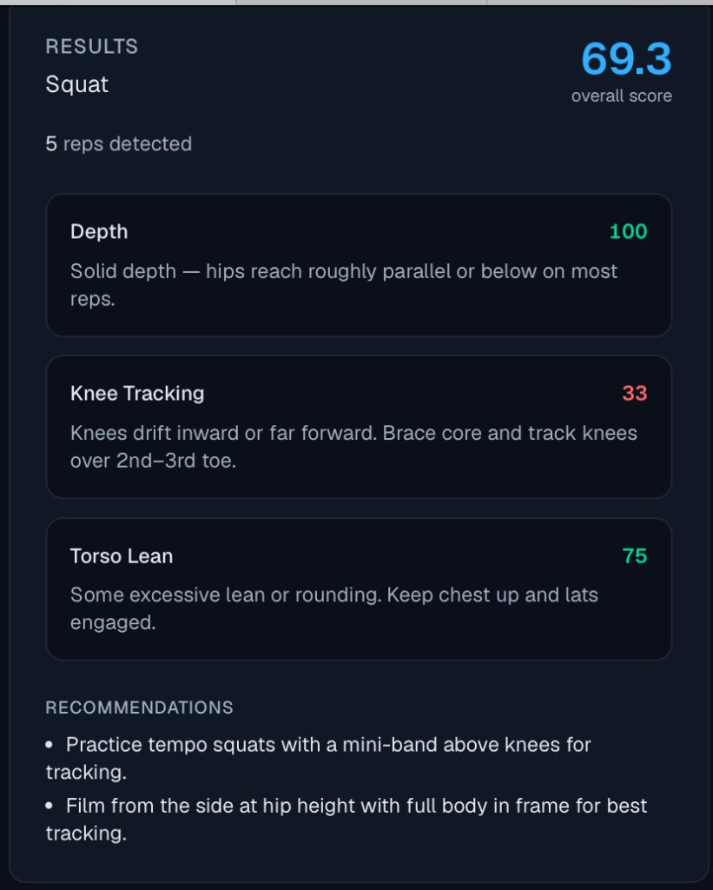
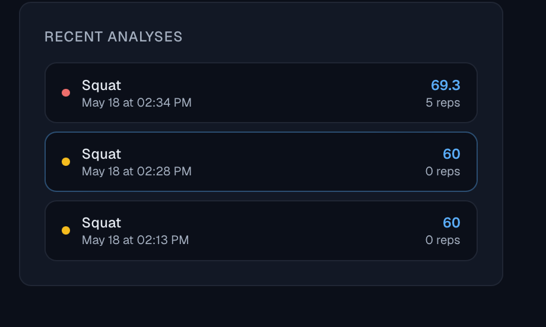
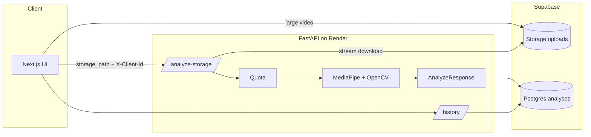

# Workout Form Coach

> Full-stack AI fitness app that analyzes squat videos using MediaPipe/OpenCV and returns rep counts, form scores, and coaching cues with persistent workout history.

**Production pipeline:** Next.js → Supabase Storage → FastAPI → MediaPipe/OpenCV → scoring → persistent workout history (Supabase Postgres).

**Resume bullet (copy/paste):** Built and deployed a full-stack computer vision fitness app using Next.js, FastAPI, OpenCV, MediaPipe, Supabase, and Render to analyze squat videos, detect reps, generate form feedback, and persist workout history.

**Demo:** [`docs/DEMO_SCRIPT.md`](docs/DEMO_SCRIPT.md) · Screenshots: [`docs/assets/`](docs/assets/) · Architecture: [`docs/ARCHITECTURE.md`](docs/ARCHITECTURE.md) · Deploy: [`docs/DEPLOY.md`](docs/DEPLOY.md)

## Live demo

| | URL |
|---|-----|
| **App** | https://visionflow.vercel.app |
| **API** | https://workout-form-coach-api.onrender.com |
| **API docs** | https://workout-form-coach-api.onrender.com/docs |

Upload a side-view squat clip (phone video OK, up to 200MB). The backend analyzes the first ~45 seconds.

## Screenshots

| Upload | Results (5 reps, 69.3 score) | History |
|--------|------------------------------|---------|
|  |  |  |

## Architecture at a glance



| Stage | What happens |
|-------|----------------|
| **Upload** | Large files → Supabase Storage `uploads` bucket; backend streams download for analysis |
| **Quota** | 5 analyses per client per rolling 24h (HTTP 429 when exceeded) |
| **Inference** | Squat → pose landmarks → rep detection (knee angle + hip fallback) → depth / knee / torso scores |
| **Persist** | Overall score, rep count, feedback JSON, recommendations → Supabase |
| **UI** | Results cards + recent analyses + detail modal |

Full diagrams, sequence flows, and scoring formulas: **[`docs/ARCHITECTURE.md`](docs/ARCHITECTURE.md)**

## Stack

- **Frontend:** Next.js (App Router), TypeScript, Tailwind CSS
- **Backend:** FastAPI, Pydantic v2, MediaPipe + OpenCV (squat analysis)
- **Database:** Supabase (Postgres) — optional for local dev (in-memory fallback)

## Project structure

```
backend/app/          # FastAPI application
  routes/             # HTTP handlers
  services/           # analyzers, Supabase store, squat pose pipeline
  core/               # config, errors
frontend/             # Next.js UI (Performance Lab aesthetic)
supabase/schema.sql   # Postgres schema
```

## Quick start

### 1. Backend

```bash
cd backend
python3.11 -m venv .venv
source .venv/bin/activate
pip install -r requirements.txt
cp .env.example .env
# Optional: set SUPABASE_URL and SUPABASE_SERVICE_ROLE_KEY
uvicorn app.main:app --reload --port 8000
```

API docs: http://localhost:8000/docs

### 2. Supabase (production / persistent history)

1. Create a Supabase project.
2. Run `supabase/schema.sql` in the SQL editor.
3. Add to `backend/.env`:
   - `SUPABASE_URL`
   - `SUPABASE_SERVICE_ROLE_KEY`

Without Supabase, the backend uses an in-memory store (fine for local testing).

### 3. Frontend

```bash
cd frontend
npm install
cp .env.example .env.local
npm run dev
```

Open http://localhost:3000

### 4. Docker (backend only)

```bash
docker compose up --build backend
```

Update root `docker-compose.yml` to point at the new backend if needed.

## API overview

| Method | Path | Notes |
|--------|------|--------|
| POST | `/analyze-storage` | Video already in Supabase Storage (production path) |
| POST | `/analyze-upload` | Multipart video (small files / local dev) |
| POST | `/upload-chunk` + `/analyze-assembled` | Chunked fallback |
| GET | `/history` | Recent analyses, `X-Client-Id` |
| GET | `/history/{id}` | Full analysis detail |

**Quota:** 5 analyses per client per rolling 24h (HTTP 429 when exceeded).

## Squat analysis

`squat` uploads run the MediaPipe Pose Landmarker pipeline (`squat_pose_analyzer.py`):

1. **Decode** video with OpenCV (~10 samples/sec)
2. **Extract** 33 pose landmarks per frame (MediaPipe Tasks API)
3. **Detect reps** from smoothed knee-angle cycles with hip-height fallback (side-view tolerant)
4. **Score** three aspects with documented heuristics:
   - **Depth** — min knee flexion per rep (target ~parallel)
   - **Knee tracking** — horizontal knee vs ankle drift
   - **Torso lean** — forward lean vs braced ~32° band
5. **Respond** with `FormFeedback[]`, overall score, rep count, recommendations

This is **applied CV + rule-based coaching**, not a custom trained model — appropriate for product/SWE roles. Logic is explicit in code and [`docs/ARCHITECTURE.md`](docs/ARCHITECTURE.md).

### Extensibility

| Component | Role |
|-----------|------|
| `ExerciseType` enum | Shared exercise IDs across API + UI |
| `routes/analyze.py` | Routes upload to the right analyzer |
| `services/analyzers.py` | Mock placeholder for non-squat lifts |
| `services/*_pose_analyzer.py` | One module per exercise pipeline (squat implemented) |

Adding deadlift = new analyzer module + one branch in the router. API response shape stays the same.

Other exercises use the mock analyzer until their pipeline exists.

## Environment variables

**Backend** (`backend/.env.example`):

- `SUPABASE_URL`, `SUPABASE_SERVICE_ROLE_KEY`, `SUPABASE_STORAGE_BUCKET` (default `uploads`)
- `CORS_ORIGINS` (include your Vercel URL)
- `DAILY_ANALYSIS_LIMIT`, `QUOTA_WINDOW_HOURS`
- `UPLOAD_DIR`

**Frontend** (`frontend/.env.example`):

- `NEXT_PUBLIC_SUPABASE_URL`, `NEXT_PUBLIC_SUPABASE_ANON_KEY` (required for large uploads in production)
- `NEXT_PUBLIC_SUPABASE_STORAGE_BUCKET` (default `uploads`)
- `NEXT_PUBLIC_API_URL` (optional; production defaults to Render API)

## Client ID

The frontend generates a persistent UUID in `localStorage` and sends it as `X-Client-Id` on all API calls for history scoping and quota tracking.

## Roadmap (portfolio priorities)

| Leverage | Item | Status |
|----------|------|--------|
| **A** | Architecture docs + diagrams | ✅ |
| **B** | Production deploy (Vercel + Render + Supabase) | ✅ |
| **C** | Rep detection + real-world phone footage | ✅ |
| **D** | Demo video + README screenshots | In progress — see `docs/DEMO_SCRIPT.md` |
| **E** | Joint angles, frame annotations in API/UI | Next |
| — | Real-time webcam | Out of scope for MVP |

## Positioning with LocalLead

| Project | Signal |
|---------|--------|
| **LocalLead** | Product, full-stack, GTM, business systems |
| **Workout Form Coach** | Applied AI, computer vision, media pipeline, health-tech |

Together: you ship end-to-end, understand users, and can go deep on technical domains when needed.
