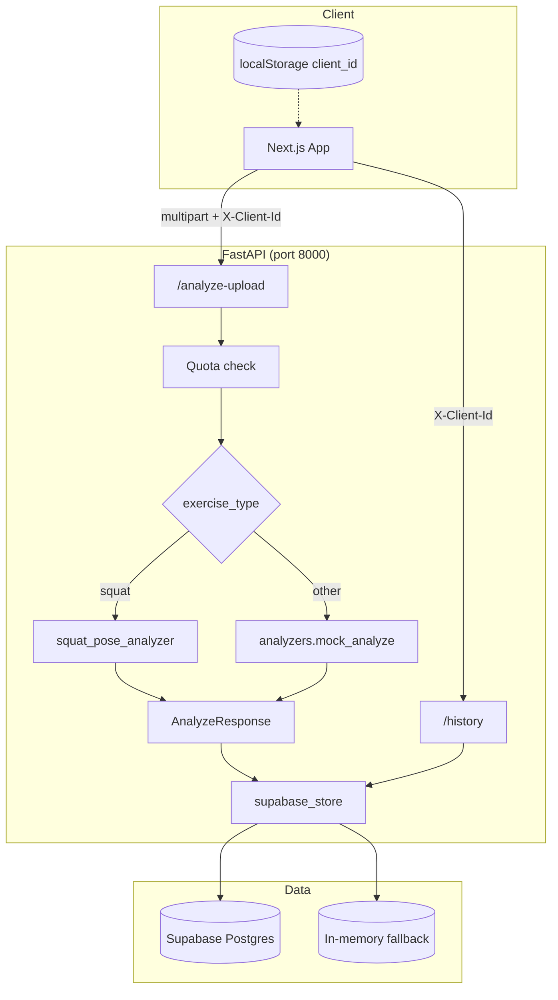
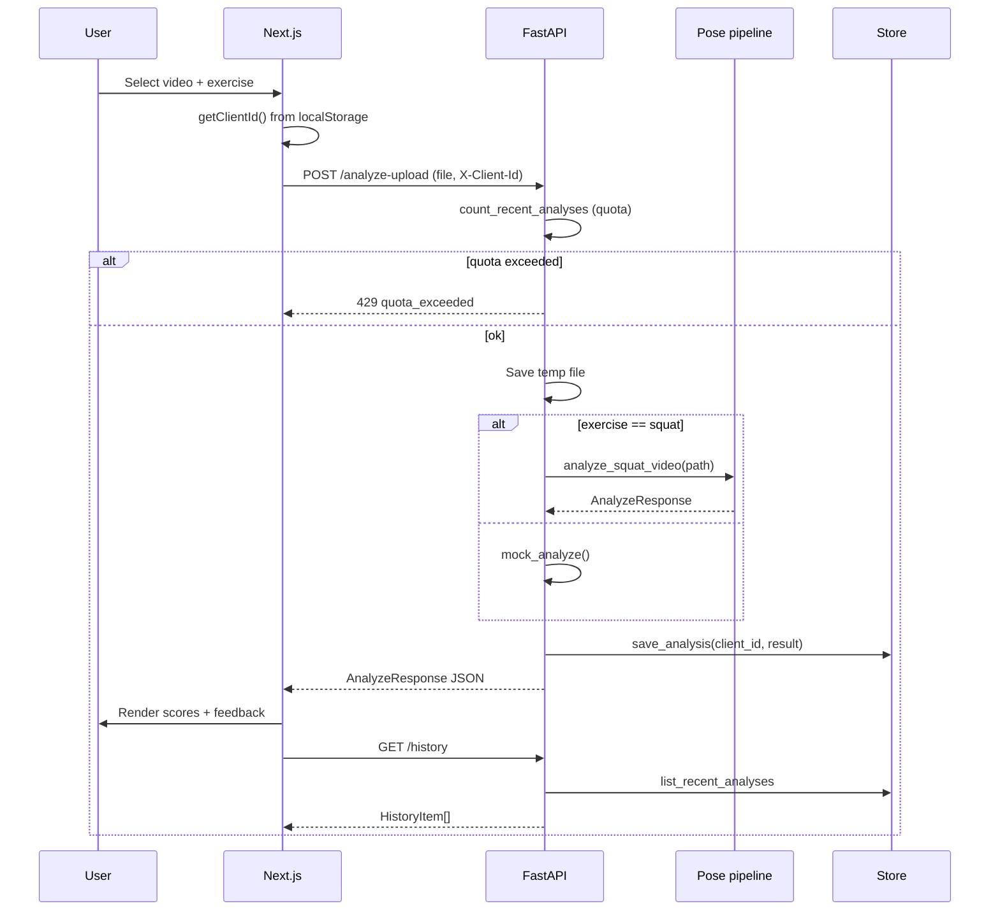
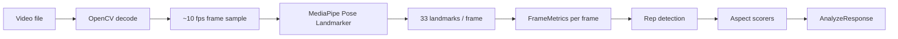
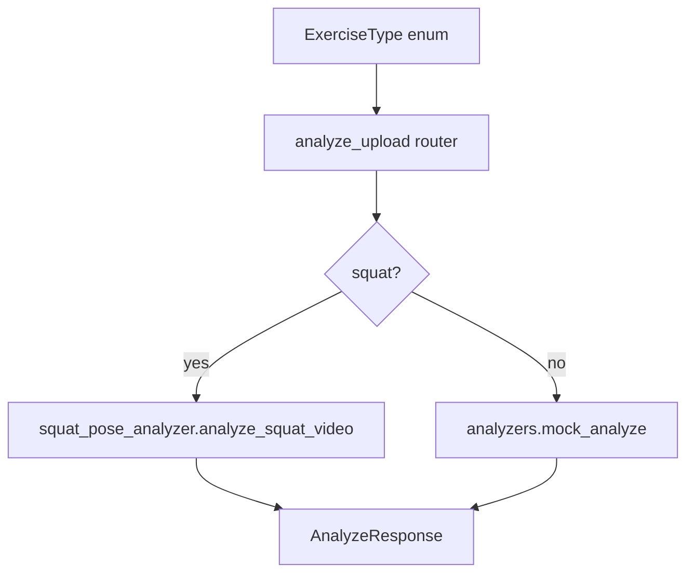

# Architecture — Workout Form Coach

Recruiter-skimmable overview of how the system is designed, how squat analysis works today, and how new exercises plug in later.

## System overview

**Design choices**

| Layer | Responsibility |
|--------|----------------|
| `routes/` | HTTP, headers, quota, temp file handling |
| `services/` | Analysis pipelines + persistence |
| `schemas.py` | Shared API contracts (Pydantic v2) |
| `core/` | Config, structured errors (e.g. 429 quota) |

Backend owns all DB access. Frontend never talks to Supabase directly.

---

## Upload → analyze → history flow

---

## Squat pose pipeline (implemented)

### Frame metrics (per valid frame)

Landmarks use MediaPipe Pose indices (hips 23/24, knees 25/26, ankles 27/28, shoulders 11/12). Frames with low landmark visibility are dropped.

| Metric | Computation |
|--------|-------------|
| `knee_angle` | Angle at knee: hip–knee–ankle (both legs, averaged) |
| `torso_lean` | Deviation from vertical: hip → shoulder vector |
| `knee_offset` | Normalized horizontal distance knee vs ankle (tracking proxy) |

### Rep detection

1. Smooth knee angles (5-frame moving average).
2. Threshold = 35th percentile of smoothed angles.
3. A rep bottom = knee angle drops below threshold, then rises >15° above it.
4. `rep_count` = number of detected bottoms.

### Scoring (heuristic, documented)

This is **biomechanics-inspired rule scoring**, not a trained model. Appropriate for an applied SWE / CV portfolio project; not positioned as ML research.

| Aspect | Logic | Score range |
|--------|--------|-------------|
| **Depth** | Min knee angle per rep; target ~≤85° at bottom → higher score | 0–100 |
| **Knee tracking** | Mean horizontal knee–ankle offset across rep segments; lower drift → higher score | 0–100 |
| **Torso lean** | Mean forward lean; penalize far from ~32° or excessive lean | 0–100 |
| **Overall** | Mean of three aspect scores | 0–100 |
| **Severity** | info ≥75, warning ≥55, else critical | per aspect |

Coaching copy is templated from score bands (see `squat_pose_analyzer.py`).

### Model artifact

On first squat run, the backend downloads `pose_landmarker_lite.task` from Google’s MediaPipe model bucket (cached under `/tmp/workout-form-coach/`). SSL uses `certifi` for macOS compatibility.

---

## Exercise abstraction (extensibility)

**Adding a new exercise (e.g. deadlift):**

1. Implement `services/deadlift_pose_analyzer.py` → returns `AnalyzeResponse`.
2. Branch in `routes/analyze.py` on `ExerciseType.deadlift`.
3. No frontend contract change — same `FormFeedback[]` shape.

Shared contract (`schemas.py`):

- `FormFeedback`: aspect, score, feedback, severity  
- `AnalyzeResponse`: exercise_type, overall_score, rep_count, feedback[], recommendations[]

---

## Persistence

| Field | Purpose |
|-------|---------|
| `client_id` | Anonymous user scope (`X-Client-Id`) |
| `feedback` | JSON array of aspect scores |
| `severity_max` | Worst severity across aspects |
| `created_at` | Quota window + history sort |

Without Supabase env vars, `supabase_store.py` uses an in-process dict so local dev works without cloud setup.

---

## Roadmap (priority order)

Aligned with portfolio leverage — not all required for MVP credit.

| Priority | Item | Status |
|----------|------|--------|
| A | Architecture docs (this file + README) | Done |
| B | Richer outputs (angles, annotated frames, confidence) | Planned |
| C | Stored artifacts (thumbnails, per-rep timestamps) | Planned |
| D | Production deployment (Vercel + Cloud Run / Railway) | Planned |
| — | Real-time webcam | Out of scope unless hackathon |

---

## What this project is / is not

**Is:** Full-stack applied CV pipeline — upload, inference, structured feedback, history, quota, modular analyzers.

**Is not:** Custom neural training, clinical-grade biomechanics, or real-time streaming (yet).

That positioning matches **SWE / applied AI intern** roles, not ML research.
